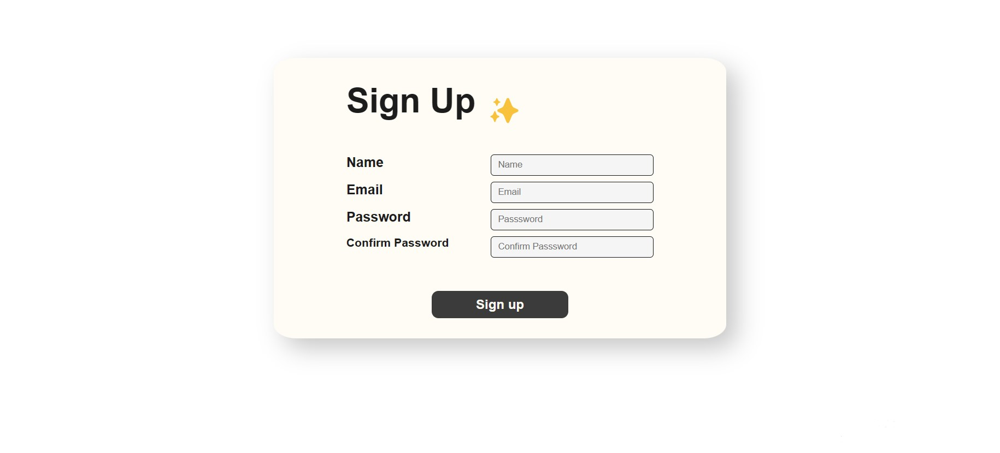
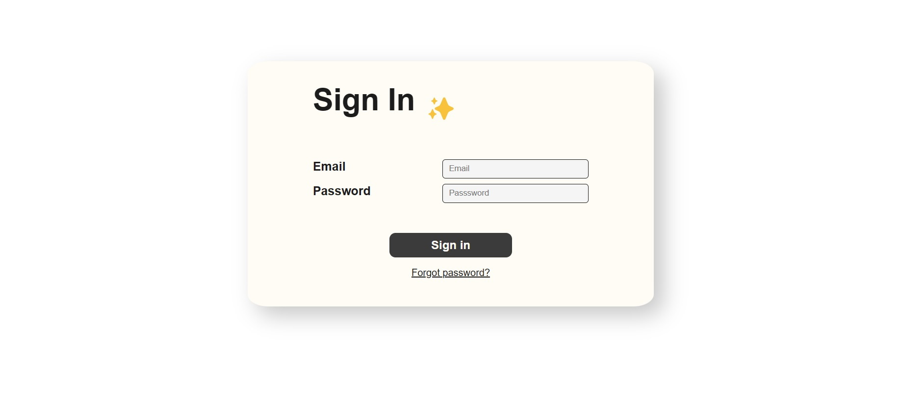
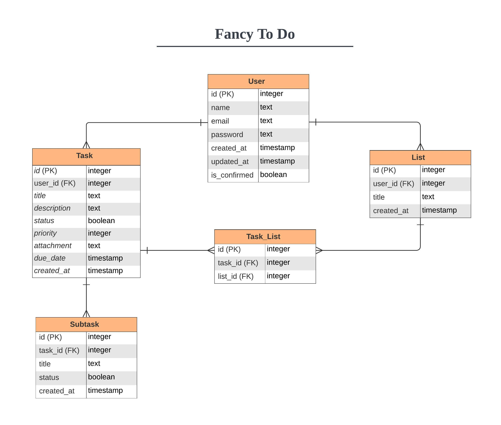
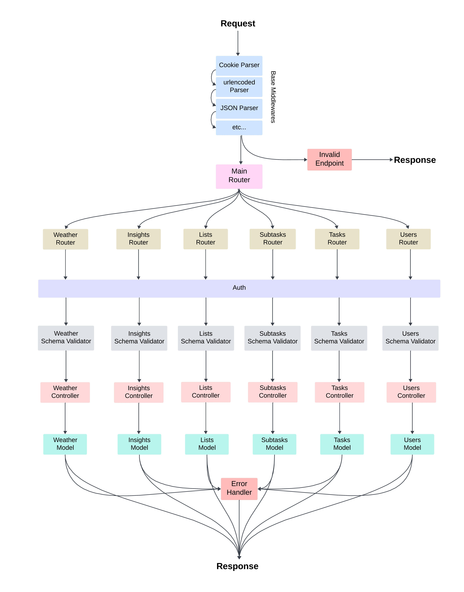

# Fancy To Do App

### An Express application to create tasks, add subtasks, and group tasks in lists. You can think of it as a feature-rich to-do application. ✨

## 👀 Overview

<p align="center">
	
</p>
<p align="center">
	
</p>
<p align="center">
	
</p>

## 🔍 Description

A backend application to create tasks with due dates, priorities and attach files to them and group them in lists. You can also add subtasks to tasks and mark them as done or undone. You can also share lists with a public link. You can also see some statistics about your tasks and the weather forecast in the upcoming 5 days. It is built with Node.js and Express.js. It uses PostgreSQL as a database and Prisma as an ORM. It also uses JWT for authentication and authorization. Azure Blob Storage is used to store files. It has a lot of fancy features like creating recurring tasks, email notification, and more. It also has a lot of testing with more than 130 tests and 90% code coverage. It also has CI/CD with GitHub Actions. 🎉

## 📜 API Documentation

- You can find the Postman collection [here](https://www.postman.com/orbital-module-technologist-63068748/workspace/fancy-to-do-apis).

## 📝 Features

### 1. User Authentication

#### All the user authentication functionalities are provided with client side using `ejs`.

- 1.1. Registration
- 1.2. Login
- 1.3. Logout
- 1.4. Forgot Password (Send a password reset link to the user's email address)
- 1.5. Update Account
- 1.6. Reset Password
- 1.7. Delete Account
- 1.8. Email Confirmation (Send a confirmation email to the user's email address)

### 2. Task Management

#### Task

- 2.1. Create Task
- 2.2. Create Recurring Task (Daily, Weekly, Monthly), Specify:
  - the date to stop repeating tasks
  - the day of the week if the task is weekly
  - the day of the month if the task is monthly
- 2.3. Update Task
- 2.4. Delete Task
- 2.5. Update Task Completion Status (Done, Undone)
- 2.6. Set Priority (High, Medium, Low)
- 2.7. Set Due Date
- 2.8. Attatch File to Task
- 2.9. Add Task to My Day (Make it due today)
- 2.10. Write Description
- 2.11. Display All Tasks
- 2.12. Display Tasks by Search
- 2.13. Display Tasks Due Today
- 2.14. Display Done Tasks
- 2.15. Display Undone Tasks
- 2.16. Sort Tasks by Priority
- 2.17. Sort Tasks by Due Date
- 2.18. Sort Tasks by Creation Date
- 2.19. Tasks Pagination (Limit, Page)

#### Subtask

- 2.19. Add Subtasks to Task
- 2.20. Delete Subtask
- 2.21. Update Subtask Completion Status (Done, Undone)
- 2.22. Update Subtask

#### List

- 2.23. Create List to Group Tasks
- 2.24. Add Task to List
- 2.25. Remove Task from List
- 2.26. Update List
- 2.27. Delete List
- 2.28. Display Lists
- 2.29. Display Tasks by List
- 2.30. Share List With Public Link

### 3. Insights

- 3.1. Display Some Statistics About The User's Tasks

  - 3.1.1 Number of Total Tasks
  - 3.1.2. Number of Done Tasks
  - 3.1.3. Number of Undone Tasks
  - 3.1.4. Number of Overdue Tasks
  - 3.1.5. Number of Tasks by Priority (High, Medium, Low)
  - 3.1.6. Lists Title and Number of Tasks in Each List

- 3.2. Display information about the weather in the upcoming 5 days
  - 3.2.1. Current Temperature
  - 3.2.2. Weather Main Title
  - 3.2.3. Weather Description
  - 3.2.4. Humidity

## 💡 Used Tools & Technologies

- **Node.js** (Runtime Environment)
- **Express.js** (Web Application Framework)
- **PostgreSQL** (Database)
- **Prisma** (ORM)
- **TypeScript** (Programming Language)
- **ejs** (Templating Engine)
- **jwt** (Authentication)
- **bcrypt** (Password Hashing)
- **joi** (Data Validation)
- **jest** (Testing Framework)
- **supertest** (HTTP Testing)
- **nodemailer** (Email Service)
- **prettier** (Code Formatter)
- **editorconfig** (Code Formatter)
- **eslint** (Code Linter)
- **GitHub Actions** (CI/CD)
- **OpenWeatherMap API** (Weather API)
- **Multer** (File Upload)
- **Azure Blob Storage** (File Storage)
- **Docker** (Containerization Platform)
- **Docker Compose** (Container Orchestration)

## 🐘 Database Schema

<p align="center">
	
</p>

## ♻️ Request Life Cycle

<p align="center">
	
</p>

## 🧐 Testing

### Unit, Integration, and Functional Tests.<br> With more than 90% code coverage and 130+ tests 🎉

<p align="center">
	
</p>

## 🔧 Pre-requisites

- `Node.js` installed on your machine.
- A `PostgreSQL` database server running whether locally or remotely. _If you gonna use Docker you won't need it._
- An `email account` to send emails from.
- An `Azure Blob Storage` account to store files.
- An `OpenWeatherMap API` key to get weather information.
- A `.env` file containing the environment variables specified in the `.env.example` file.

## 📦 Installation

- Clone the repository

```bash
git clone https://github.com/ab-elhaddad/Fancy-ToDo.git
```

### You have **two** options whether run the project _locally_ on your host machine or using _Docker_...

#### 📌 Locally :-

- Install dependencies

  But first install node-gyp dependencies. You can find more information [here](https://github.com/nodejs/node-gyp).

  ```bash
  npm i -g node-gyp
  ```

- Install packages

  ```bash
  npm install
  ```

- Generate Prisma Client

  ```bash
  npx prisma generate
  ```

- Run the server

  ```bash
  npm start
  ```

#### 🐳 Docker:-

- Run Docker container

  ```bash
  docker-compose up -d
  ```
